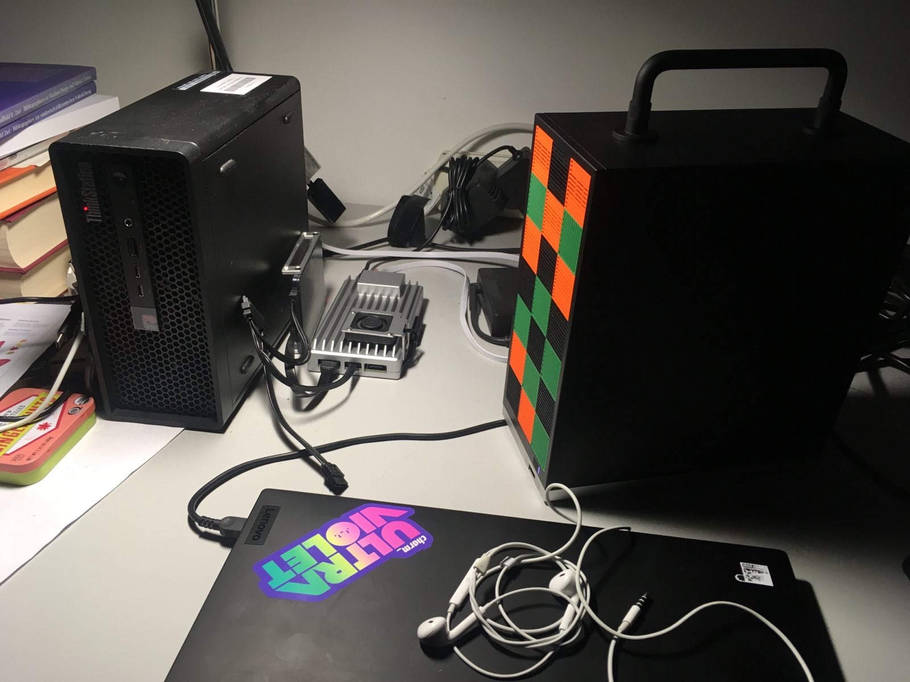
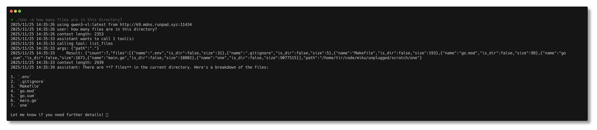
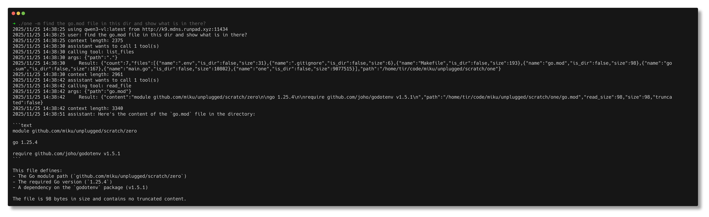
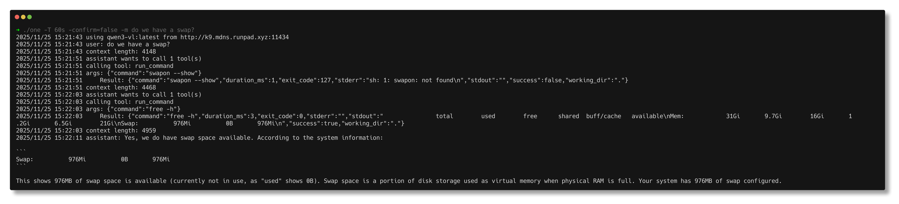

# Writing a simple agent in Go

> Ligthing talk, [Leipzig Gophers](https://golangleipzig.space) #56, [Martin Czygan](https://www.linkedin.com/in/martin-czygan-58348842/)

Google released an ADK for various languages, including Go:
[google/adk-go](https://github.com/google/adk-go).

A downside is that their backend is closely tied to Gemini:

* [#233](https://github.com/google/adk-go/pull/233) anthropic model support [open, as of 2025-11-25]
* [#242](https://github.com/google/adk-go/pull/242) openai api support [open, as of 2025-11-25]

Wanted to use local models, and there was this blog post: [You Should Write An
Agent](https://fly.io/blog/everyone-write-an-agent/).

> You’re allotted a fixed number of tokens in any context window. Each input
> you feed in, each output you save, each tool you describe, and each tool
> output eats tokens (that is: takes up space in the array of strings you keep
> to pretend you’re having a conversation with a stateless black box). Past a
> threshold, the whole system begins getting nondeterministically stupider.
> Fun!

> No, really. Fun! You have so many options. Take “sub-agents”. People make a
> huge deal out of Claude Code’s sub-agents, but you can see now how trivial
> they are to implement: just a new context array, another call to the model.
> Give each call different tools. Make sub-agents talk to each other, summarize
> each other, collate and aggregate. Build tree structures out of them. Feed
> them back through the LLM to summarize them as a form of on-the-fly
> compression, whatever you like.

> **Your wackiest idea will probably (1) work and (2) take 30 minutes to code.**

Also, self-hosted, with tool support:

* gpt-oss:20b, gpt-oss:120b
* qwen3-vl
* qwq
* llama3.3
* ...



## ok, from scratch then

Start with two ingredients

* loop
* tool


> [LLM with tools: A survey](https://arxiv.org/pdf/2409.18807) (2024-09-24)

> tool invocation timing, selection accuracy, and the need for robust reasoning
> processes

> [...] **unsatisfactory** in certain professional fields, especially in scenarios
> that require **precision**

Other papers:

> [REACT : SYNERGIZING REASONING AND ACTING IN LANGUAGE
> MODELS](https://arxiv.org/pdf/2210.03629), original blog post from
> [2022-11-08](https://research.google/blog/react-synergizing-reasoning-and-acting-in-language-models/)

> useful thoughts, e.g. decomposing task goals and create action plans (2b, Act
> 1; 1d, Thought 1), injecting commonsense knowledge relevant to task solving
> (2b, Act 1), extracting important parts from observations (1d, Thought2, 4),
> track progress and transit action plans (2b, Act 8), handle exceptions and
> adjust action plans (1d, Thought 3), and so on.


## tool call

* chat request with tools: [openai.go#L98-L117](https://github.com/ollama/ollama/blob/47e272c35a9d9b5780826a4965f3115908187a7b/openai/openai.go#L98-L117)

## using a modelfile

A static variant, using a modelfile to bake in tools.

```
$ cat modelfiles/unplugged-gemma3-weather.modelfile
FROM gemma3:latest

SYSTEM """
A program is used to interact with you and the user. The program allows you to use functions/tools
to get external information. When you use a tool, the program will respond with JSON data. Anything else is
coming from the user and should be treated as human interaction.

To use a tool, respond with a JSON object with the following structure:
{
    "tool": <name of the called tool>,
    "tool_input": <parameters for the tool matching the above JSON schema>
}
Do not include any other text in your response.

If the user's prompt requires a tool to get a valid answer, use the above format to use the tool.
After receiving a tool response, continue to answer the user's prompt using the tool's response.
If you don't have a relevant tool for the prompt, answer it normally. Be fun and interesting.

Here are your available tools:

getCurrentWeather
Get the current weather in a given location
{
    "type": "object",
    "properties": {
        "location": {"type": "string", "description": "The city and state, e.g. San Francisco, CA"},
        "unit": {"type": "string", "enum": ["celsius", "fahrenheit"]}
    },
    "required": ["location", "unit"]
}
"""
```

## iteration: 0

```go

func runAgentLoop(client *LlmClient, model string, registry *ToolRegistry, userMessage string) error {
	// messages to start with, TODO: tweak this
	messages := []Message{
		{
			Role:    "system",
			Content: "You are a helpful assistant with access to tools. Use them when needed.",
		},
		{
			Role:    "user",
			Content: userMessage,
		},
	}
	maxIterations := 10
	for i := 0; i < maxIterations; i++ {
		req := ChatRequest{
			Model:    model,
			Messages: messages,            // history
			Tools:    registry.GetTools(), // all tools, will take up space
			Stream:   false,
		}
		resp, err := client.Chat(req)
		if err != nil {
			return fmt.Errorf("chat error: %w", err)
		}
		if len(resp.Message.ToolCalls) > 0 {
			log.Printf("assistant wants to call %d tool(s)", len(resp.Message.ToolCalls))
			messages = append(messages, resp.Message)
			for _, tc := range resp.Message.ToolCalls {
				log.Printf("calling tool: %s", tc.Function.Name)
				argsJSON, _ := json.Marshal(tc.Function.Arguments)
				log.Printf("args: %s", string(argsJSON))
				result, err := registry.Execute(tc.Function.Name, tc.Function.Arguments)
				if err != nil {
					result = fmt.Sprintf(`{"error": "%s"}`, err.Error())
				}
				log.Printf("    Result: %s", result)
				messages = append(messages, Message{
					Role:    "tool",
					Content: result,
				})
			}
		} else {
			log.Printf("assistant: %s", resp.Message.Content)
			return nil
		}
	}
	return fmt.Errorf("max iterations reached")
}
```

## iteration: 1

Just adding tools.


```
$ scratch/one/one -t | jq -rc .[].function.name
get_weather
add_numbers
get_time
search_library_catalog
ping
list_files
read_file
grep
write_file
append_file
run_command
```

It seems to work, at least in the harmless cases.

### list files



### read file



### write file

Write and overwrite files.

### execute command


do we have swap?



## tool calling leaderboard

Which model to use?

* https://gorilla.cs.berkeley.edu/leaderboard.html

## any other ideas?

* ...

## playground

[](https://www.europeana.eu/en/item/775/_nhdw3mV)

## credits

* [playground image](https://www.europeana.eu/en/item/775/_nhdw3mV)
