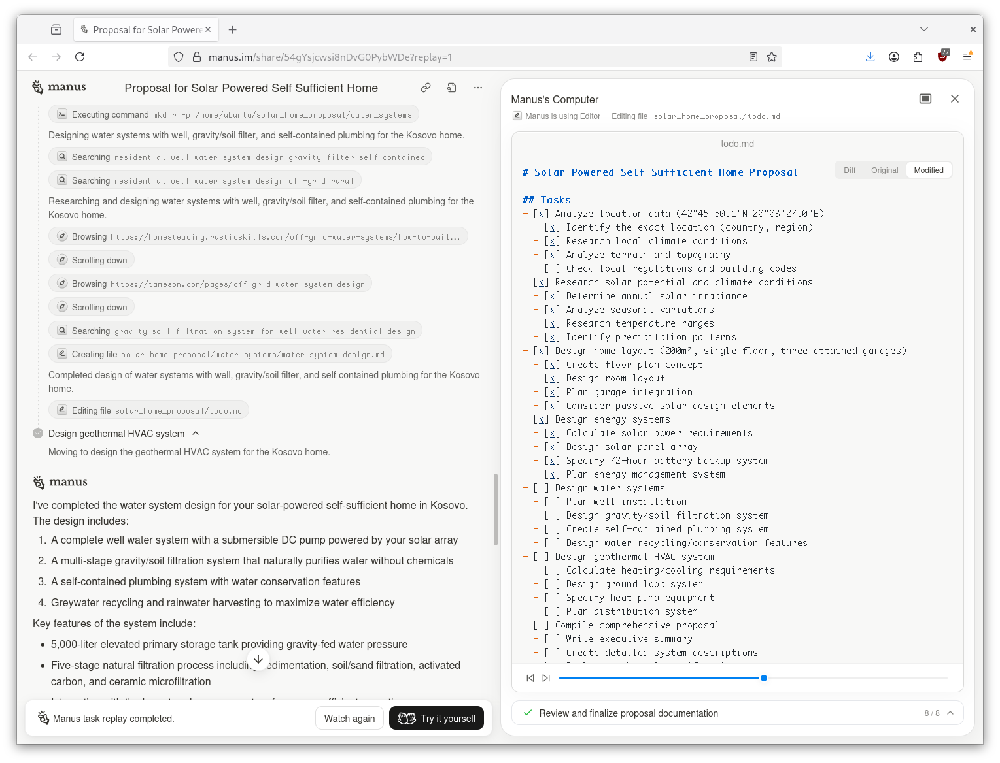
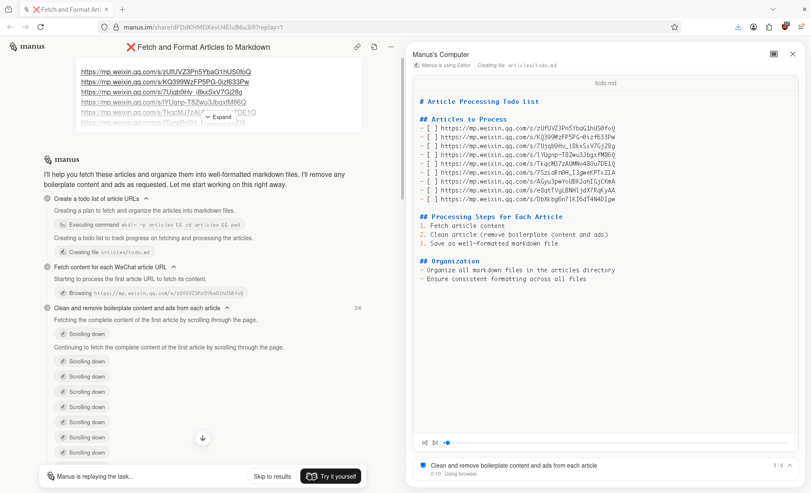

# outline

* nodes, splitter "decide", then other tools
* feed back to decide node

Phases:

* prep
* exec
* post

Shared store, accessible by all nodes, key value store.

Agent, prompts, set of tools. Loop, prompt, switch.

## react (reasoning and acting)

> [REACT : SYNERGIZING REASONING AND ACTING IN LANGUAGE
> MODELS](https://arxiv.org/pdf/2210.03629), original blog post from
> [2022-11-08](https://research.google/blog/react-synergizing-reasoning-and-acting-in-language-models/)

> This tight synergy between “acting” and “reasoning” allows humans to learn
> new tasks quickly and perform robust decision making or reasoning, even under
> previously unseen circumstances or facing information uncertainties.

> [...] Instead, a thought ˆat aims to compose useful information by reasoning
> over the current context ct, and update the context ct+1 = (ct, ˆat) to
> support future reasoning or acting.

> useful thoughts, e.g. decomposing task goals and create action plans (2b, Act
> 1; 1d, Thought 1), injecting commonsense knowledge relevant to task solving
> (2b, Act 1), extracting important parts from observations (1d, Thought2, 4),
> track progress and transit action plans (2b, Act 8), handle exceptions and
> adjust action plans (1d, Thought 3), and so on.

## tool calling leaderboard

* https://gorilla.cs.berkeley.edu/leaderboard.html

## tasks

### list files

### read file

### write file

Write and overwrite files.

### execute command

do we have swap?

## generic agent systems

* Planner Agent: Analyzes user requests and creates step-by-step execution plans
* Execution Agent: Carries out instructions by interacting with web browsers, databases, and code environments
* Knowledge Agent: Handles information retrieval and maintains contextual understanding
* Verification Agent: Reviews completed work for quality assurance

Showcases, [manus](https://en.wikipedia.org/wiki/Manus_(AI_agent)): [https://manus.so/p/showcases](https://manus.so/p/showcases)

, from [recording](https://manus.im/share/54gYsjcwsi8nDvG0PybWDe?replay=1)

* search
* browse, "scrolling down", "clicking element",
* execute command, "mkdir"
* edit todo file

, from [recording](https://manus.im/share/dFDdKHMDXevU4EluB6u3i9?replay=1)

## multi-agent

* A Research Agent: Its only job is to scour the web for information.
* A Strategy Agent: It takes the research & formulates a high-level plan.
* A Copywriting Agent: It writes the ad copy, blog posts, & social media updates.
* A Project Manager Agent: This one oversees the whole process, passing tasks between the other agents & ensuring the final goal is met.

## context structure

* context
* provide
* output requirements
* format

## context engineering

* https://www.anthropic.com/engineering/effective-context-engineering-for-ai-agents

> Context refers to the set of tokens included when sampling from a
> large-language model (LLM). The engineering problem at hand is optimizing the
> utility of those tokens against the inherent constraints of LLMs in order to
> consistently achieve a desired outcome. Effectively wrangling LLMs often
> requires thinking in context — in other words: considering the holistic state
> available to the LLM at any given time and what potential behaviors that
> state might yield.

## misc

Natural language is ambiguous, the more text, the more room for interpretation.

> Using Kolmogorov complexity, we demonstrate that as an expression’s
> complexity grows, the amount of contextual information required to reliably
> resolve its ambiguity explodes combinatorially.

## refs

* [Context Engineering for AI Agents: Lessons from Building Manus](https://manus.im/blog/Context-Engineering-for-AI-Agents-Lessons-from-Building-Manus)
* [A Beginner's Guide to Building a Multi-Agent LLM System in Go](https://www.arsturn.com/blog/a-beginners-guide-to-building-a-multi-agent-llm-system-in-go)

