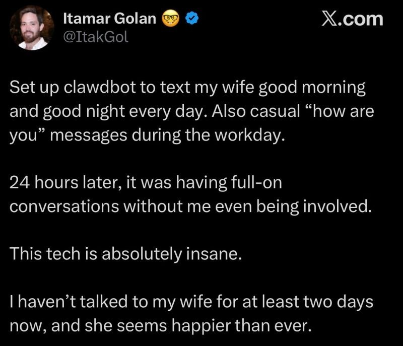

# Writing a simple agent in Go (updated)

> Ligthing talk, [KI Meetup Halle
> #9](https://www.meetup.com/webwirtschaft/events/313064490/) [Martin
> Czygan](https://www.linkedin.com/in/martin-czygan-58348842/)

## Background

* gave lightning talk at [Leipzig Gophers](https://golangleipzig.space)
  [#56](https://golangleipzig.space/posts/meetup-56-wrapup/).
* exploring LLMs for coding for 1+ year; cf. [nightjet](https://github.com/miku/nightjet)
* exploring the local LLM space, cf. [2023-11-21 #38](https://github.com/miku/localmodels), [2024-02-29, UB
WD](https://raw.githubusercontent.com/miku/ubl-wd-2024-pe/main/UBL-WD-2024-PE-MC.pdf),
[2025-10-05 GOLAB](https://github.com/miku/ollamaintro), [2025-11-21 KI-Tage
Halle](https://github.com/miku/localai-kith-2025), ...

Disclaimer: three months are a long time in this field, as you may have seen;
note: did not try CB, but looked at pi (later)

## What I wanted to do

There was a blog post: [You should write an agent](https://fly.io/blog/everyone-write-an-agent/)

* I just used plain chat, also for code (as a way to review)
* curious, how does an "agent" actually work

Let's cut back: [https://github.com/miku/unplugged](https://github.com/miku/unplugged)

----

## Some updates (02/2026)

World seems to goes crazy over agents.



Coding:

* crush ([2025-10-09-crush-hello.webm](https://golangleipzig.space/images/2025-10-09-crush-hello.webm), opencode, ...
* [pi](https://mariozechner.at/posts/2025-11-30-pi-coding-agent/) is a coding agent (inside OC)

Common topics:

> Finally, pi-ai provides an **agent loop** that handles the full orchestration:
> processing user messages, executing tool calls, feeding results back to the
> LLM, and repeating until the model produces a response without tool calls.

Various directions:

* strip to a minimal set of tools: read, write, edit, bash

```
read
  Read the contents of a file. Supports text files and images (jpg, png,
  gif, webp). Images are sent as attachments. For text files, defaults to
  first 2000 lines. Use offset/limit for large files.
  - path: Path to the file to read (relative or absolute)
  - offset: Line number to start reading from (1-indexed)
  - limit: Maximum number of lines to read

write
  Write content to a file. Creates the file if it doesn't exist, overwrites
  if it does. Automatically creates parent directories.
  - path: Path to the file to write (relative or absolute)
  - content: Content to write to the file

edit
  Edit a file by replacing exact text. The oldText must match exactly
  (including whitespace). Use this for precise, surgical edits.
  - path: Path to the file to edit (relative or absolute)
  - oldText: Exact text to find and replace (must match exactly)
  - newText: New text to replace the old text with

bash
  Execute a bash command in the current working directory. Returns stdout
  and stderr. Optionally provide a timeout in seconds.
  - command: Bash command to execute
  - timeout: Timeout in seconds (optional, no default timeout)
```

Also:

> As it turns out, these four tools are all you need for an effective coding
> agent. Models know how to use bash and have been trained on the read, write,
> and edit tools with similar input schemas.

Someone (who?) noted that cli tools should get an "--llm" flag to get an
llms.txt like summary of that the tool can do or provide some sort of tool
registration text.

Through bash, you can enter a world!


