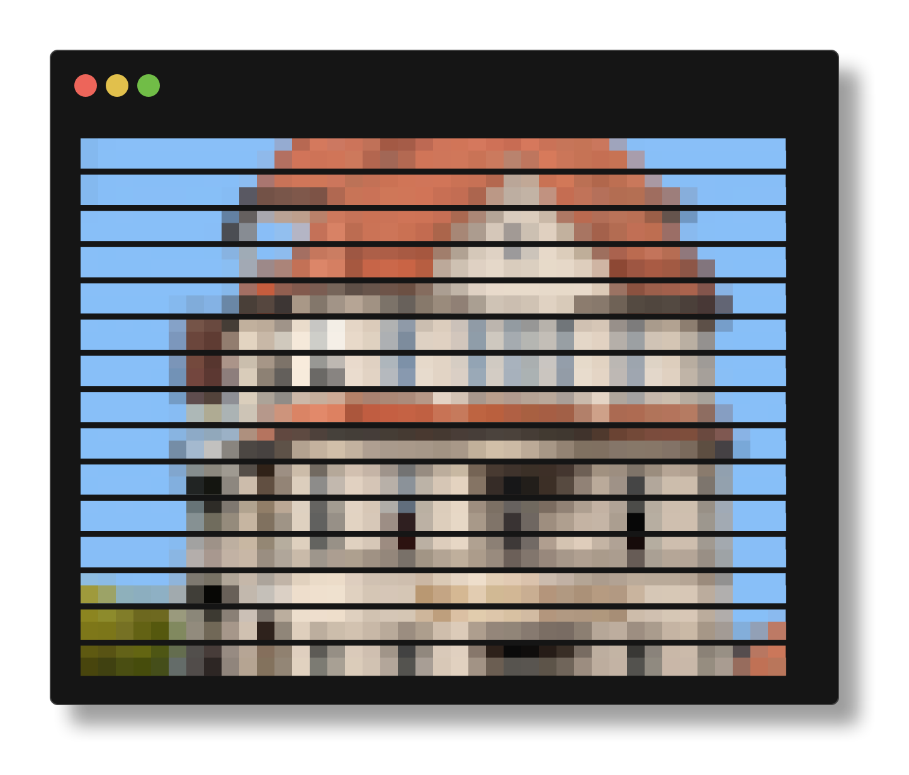

# KI meetup #11 notes

> 2026-04-15 at KTCOW, Halle



## Misc

* [open interpreter](https://www.openinterpreter.com/)

```shell
$ uv tool install git+https://github.com/OpenInterpreter/open-interpreter.git
```

* [Estimating the Number of Faults in Code](https://ieeexplore.ieee.org/document/5010260)
* [nanochat](https://github.com/karpathy/nanochat)
* [autoresearch](https://github.com/karpathy/autoresearch)
* [promptfoo](https://github.com/promptfoo/promptfoo#readme)

